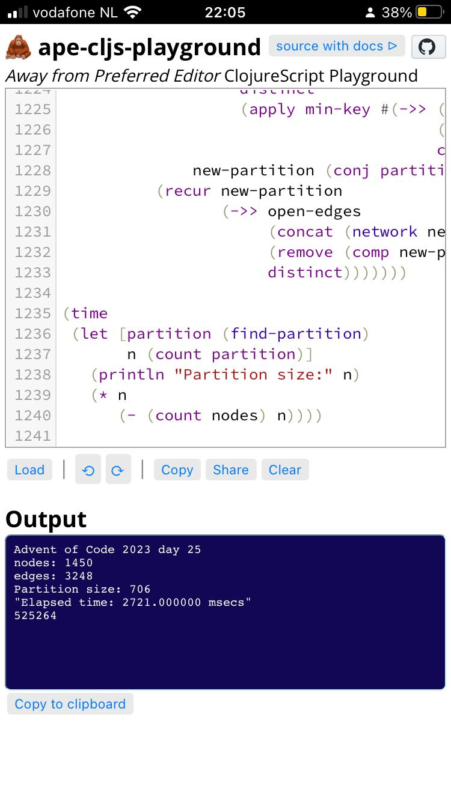

# ape-cljs-playground
*Away from Preferred Editor ClojureScript Playground*

Write and evaluate ClojureScript in your mobile device's browser.
Code is stored in your browser's `localStorage`.
Parentheses are kept balanced by [Parinfer](https://shaunlebron.github.io/parinfer/).

Powered by the amazing [Scittle](https://babashka.org/scittle/)
(as well as by [Reagent](https://reagent-project.github.io) and
[CodeMirror](https://codemirror.net/)),
all you need is
[index.html](https://github.com/jurjanpaul/ape-cljs-playground/blob/main/index.html)
(which includes some documentation as inline comment).

Host it yourself or simply use https://jurjanpaul.github.io/ape-cljs-playground.

